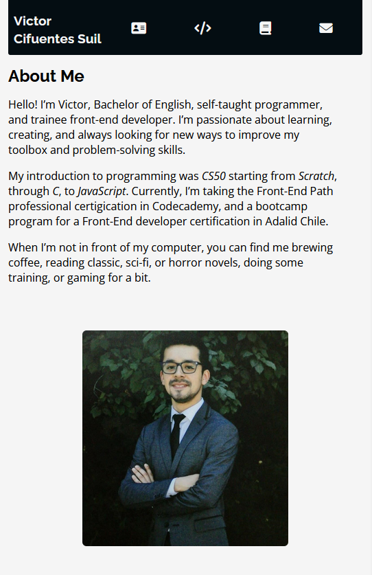

# Portafolio Web
A responsive personal web portfolio made only with HTML, CSS, and JavaScript, geared toward the tech sector and designed to showcase my experience, projects, and contact information in a minimalist and dynamic way. It presents a description of myself, a list of some projects I have developed, a list of the skills and technologies I am experienced in, and a list of links to get in touch with me or check out my repository.

* The portfolio is deployed currently on Github Pages: https://veehto.github.io/my-portfolio/


## Feedback curso Adalid Chile
### Portafolio
* Cambios generales:
    - Se suavizan los bordes de la barra de navegación, footer, tarjetas y foto siguiendo una proporción.
    - Se corrigen comportamientos inesperados de la responsividad del sitio.

* Se cambia el diseño de las tarjetas de la sección de Proyectos:
    - Interacción con las tarjetas ahora es más intuitiva.
    - Comunica de mejor manera las tecnologías usadas en los proyectos.
    - Mejora la responsividad de las tarjetas para pantallas más pequeñas.
    - Se suavizan los borders de las tarjetas.
    - Se cambia el fondo blanco puro de las tarjetas.

* Sección de Habilidades:
    - Se agregan dos íconos más.
    - Los íconos ahora se despliegan de forma equitativa, también tomando en cuenta la responsividad del sitio.


## Main Features
- **Responsive Design**: Adapts to any device (mobile, tablet, desktop).
- **Sections**: Home, About Me, Projects, Skills (technologies I use) and Contact.
- **Minimalist Design**: Built only with HTML5, CSS3 and JavaScript.


## Screenshots
<br>
Home with a Navbar, About me section with a description and a picture.

<br>
Project section, with some personal projects.

<br>
Project section, clicking the project card's title shows a description.

<br>
Skills section, having a list of icons representing the technologies I have used. 

<br>
Contact section, Showing icons that take you to my LinkedIn page, Github page, and a mail icon that copies my email to your clipboard on click.

<br>
Home, About me sections responsive behavior.

<br>
Home, About me sections responsive behavior, smaller screens.

<br>
Projects section responsive behavior.

<br>
Skills and Contact sections responsive behavior.


## Technologies used 🛠️
- [Vite](https://vitejs.dev/).
- [HTML](https://developer.mozilla.org/en-US/docs/Glossary/HTML5).
- [CSS](https://developer.mozilla.org/en-US/docs/Web/CSS).
- [JavaScript](https://developer.mozilla.org/en-US/docs/Web/JavaScript).


## Execute Code locally 🚀
These instructions will allow you to get a working copy of the project into your local environment for development and testing purposes.

### Prerequisites 📋
To run this project you need to have installed:

- [Node.js](https://nodejs.org/) (v14.0.0 or higher)
- [npm](https://www.npmjs.com/) (v6.0.0 or higher)

### Installation 🔧
1. Clone the repository:

```bash
git clone git clone https://github.com/Veehto/my-portfolio tu_carpeta
cd tu_carpeta
code .
```

2. Install dependencies:
```bash
npm install
```

3. Run development server:
```bash
npm run dev
```

4. Page will be ready to check on `http://localhost:5173`.


## Deployment 📦
To create a production version and deploy it:

1. build the project:

```bash
npm run build
```

2. install npm serve package:

```bash
  npm install -g serve
```

3. Start the server:

```bash
  serve -s dist
```

4. The generated files will be in the folder `dist/`, that you can upload to any static hosting service such as:
   - [Netlify](https://www.netlify.com/).
   - [Render](https://vercel.com/).
   - [GitHub Pages](https://pages.github.com/).


## Project directories 📁
```
.
├── node_modules
├── src/
│   ├── css/
│   │   └── style.css
│   ├── icons/
│   ├── images/
│   │   └── screenshots
│   ├── copyToClipboard.js
│   ├── counter.js
│   ├── project-list.js
│   └── vite-splash-page.js
├── .env
├── .gitignore
├── index.html
├── package-lock.json
├── pachake.json
└── README.md
```


## Roadmap (Future implementations)
* Add a Certifications section showing completed (and/maybe in progress) certifications.
* Implement light/dark themes.
* implement site's data in JSON files for dynamic rendering.


## Contributions 🤝
Contributions are welcome. To contribute:

1. Fork the project.
2. Create a branch for your suggested feature (`git checkout -b feature/amazing-feature`).
3. Commit changes (`git commit -m 'Add some amazing feature'`).
4. Push to branch (`git push origin feature/amazing-feature`).
5. Open a pull request.


## Author
Made with ❤️ by [Victor CS](https://github.com/Veehto).

## Acknowledgements
- [Aspasia, Adalid Chile, Bootcamp Online Especialización en Desarrollo de Aplicaiones Front-End](https://www.corfo.cl/sites/becascapitalhumano/convocatorias/frontend_2024)
- [Codecademy's Full-Stack Development, Professional Certification](https://www.codecademy.com/learn/paths/full-stack-engineer-career-path)